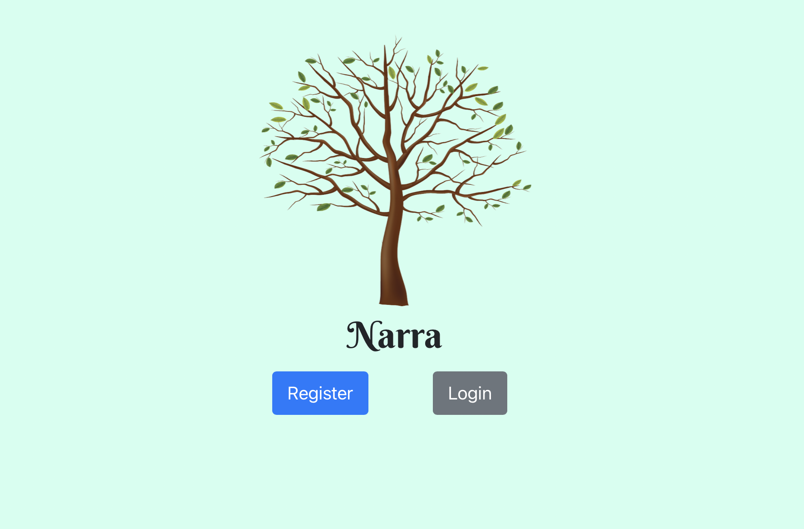

# Narra



Natalia Luzuriaga, Raphael Gatchalian, Angela Hu, Roshni Rao, Abhijaat Gupta for the class CS 97: Software Construction Projects, UCLA Fall 2020.

Narra is a personality matching web application that connects users based on the compatibility of their MBTI (Myers-Briggs Type Indicator) personality type.

LINK TO REPOSITORY: https://github.com/natalialuzuriaga/narra

## How to run the app locally

In the command line, run:

```
git clone https://github.com/natalialuzuriaga/narra.git
```

To clone the repository in your local directory. Then, install the packages needed to run the app by invoking the following commands:

```
npm install  
cd backend
npm install
```

While still in the backend, run a new server:

```
node server
```

Open a new command line window, navigate to the root directory, and now you can start it in your browser:

```
npm start
```

If a warning pops up, input `Y`. Now, you can open [http://localhost:3001](http://localhost:3001) to view the app in your browser, since localhost:3000 is taken by the server.

## While using the app

After logging in or registering, and landing on the matching page, please either uncomment out the console.log on line #126 of the source code in match.component.js within the components folder or add another console.log after this line and save the file.

## Tech Stack

This app uses the MERN stack: MongoDB, Express.js, React.js, and Node.js. The front-end components are all written in React.js, with minimal CSS and HTML, while the backend is written in Express.js and is linked to MongoDB and uses Node.js as its runtime environment.
